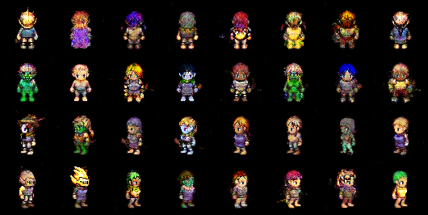
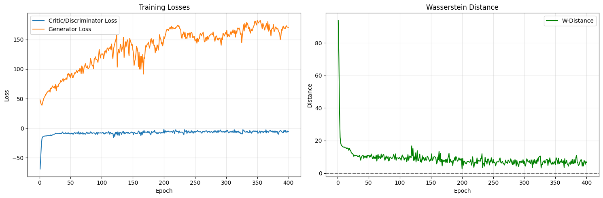
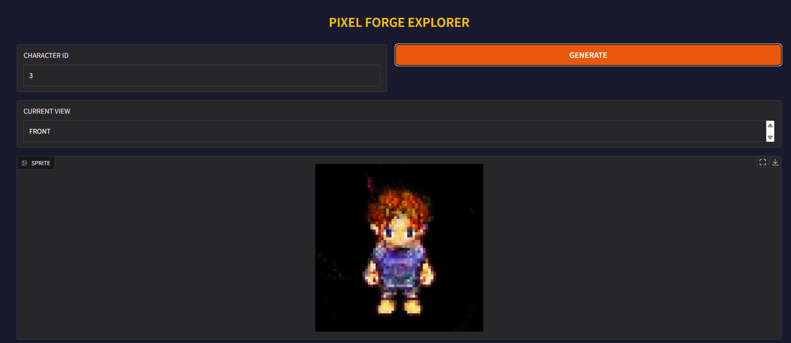
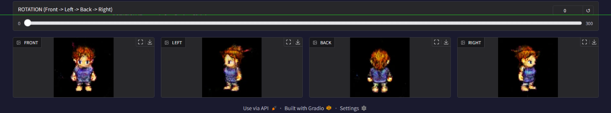

# PixelForge — Conditional GAN for Pixel Art Sprite Generation

**Author:** Vandan Agrawal · **Repo:** [atom218/Pixel-art-generation-](https://github.com/atom218/Pixel-art-generation-)

## 1. Project Overview

PixelForge is a Conditional WGAN-GP trained from scratch in PyTorch to generate 64×64 pixel art character sprites conditioned on view angle (front, back, left, right). Using the TinyHero dataset (3,648 sprites, Kaggle), the model learns novel, class-conditioned sprite generation and supports smooth latent-space rotation between viewing angles via a Gradio GUI.

## 2. Installation & Run

```bash
git clone https://github.com/atom218/Pixel-art-generation-.git
cd Pixel-art-generation-
pip install torch torchvision pillow tqdm gradio numpy
```

Train from scratch, run hyperparameter sweep, or launch the GUI:

```bash
python "process files/training.py"               # train (checkpoints saved to ./output)
python "process files/hyperparameter_tuning.py"  # 12-config sweep
python "process files/GUI2.py"                   # launch Gradio explorer
```

The end-to-end pipeline (training + inference + GUI) is also runnable as a single notebook: `final submission/final submission notebook.ipynb`.

## 3. Model Architecture

**Generator.** Noise (100-dim) + one-hot label (4-dim) → Linear projection → reshape (512, 4, 4) → 4× ConvTranspose2d (4→64px) → Sigmoid. Sigmoid over Tanh: preserves hard pixel art color boundaries. BatchNorm2d + ReLU after each upsampling layer.

**Critic (Discriminator).** Image (3, 64, 64) + class embedding map (1, 64, 64) → 4× strided Conv2d → raw scalar score (no Sigmoid). InstanceNorm2d over BatchNorm2d: required so the gradient penalty's second-order gradients are not corrupted by inter-sample batch statistics.

**WGAN-GP Loss.** L_D = E[D(fake)] − E[D(real)] + 10·GP, L_G = −E[D(fake)]. Gradient penalty enforces 1-Lipschitz on the critic, providing non-vanishing gradient to G regardless of critic confidence — directly fixing the collapse seen in v1.

| Epochs | Batch | LR | Adam β1/β2 | D_STEPS | GP_λ | Grad Clip |
|---|---|---|---|---|---|---|
| 400 | 64 | 1e-4 → 5e-5 (ep.200) | 0.0 / 0.9 | 5 | 10 | max_norm=1.0 |

## 4. Results

Generated samples after 300 epochs (4 rows = 4 view angles, conditioning vector held constant per column):



Training curves — critic loss stabilises near zero while Wasserstein distance decreases monotonically, confirming healthy WGAN-GP dynamics:



## 5. Extra Criteria Pursued

**(a) Gradio GUI — Character Angle Explorer.** Users enter a character number (0–900) — mapped deterministically to a noise seed — and all four view angles are generated as thumbnails. A rotation slider (0–300, three 100-step segments) SLERP-interpolates conditioning vectors between adjacent angles (front→left→back→right), producing smooth angular transitions while keeping character identity fixed. Sprites are upscaled 4–5× with nearest-neighbour for crisp pixel art. Runs in Colab via `demo.launch(share=True)`.





**(b) Hyperparameter Sweep (`hyperparameter_tuning.py`).** 12 configurations across `lr ∈ {1e-4, 2e-4}`, `batch_size ∈ {32, 64}`, `noise_dim ∈ {50, 100, 200}`, each trained for 25 epochs. Scored by a lightweight FID approximation using discriminator conv features rather than InceptionV3, which is inappropriate for 64×64 pixel art (trained on natural photos).

## 6. Difficulties & Solutions

- **Discriminator collapse (v1):** BCE loss saturated by epoch 50 (loss_D=0.007, loss_G=6–13). Switched to WGAN-GP — provides non-saturating gradient regardless of critic confidence.
- **Dataset pivot:** Custom sprite-sheet slicer for OpenGameArt produced unusable pixel fragments. Adopted TinyHero (pre-sliced), repurposing conditioning from character class to view angle.
- **AMP incompatibility (v3):** float16 silently violated the Lipschitz constraint, producing neon noise blobs. Removed AMP; full float32 is required for gradient penalty correctness.
- **Training speed:** D_STEPS=5 means 5 critic backward passes per generator step. Mitigated with DataLoader `pin_memory`, `num_workers=4`, and LR halving at epoch 200.
